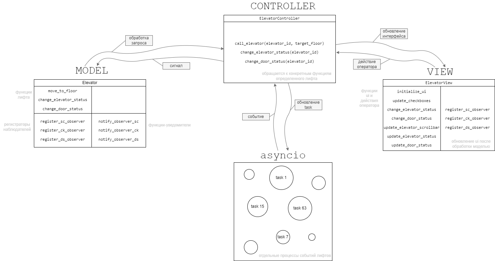
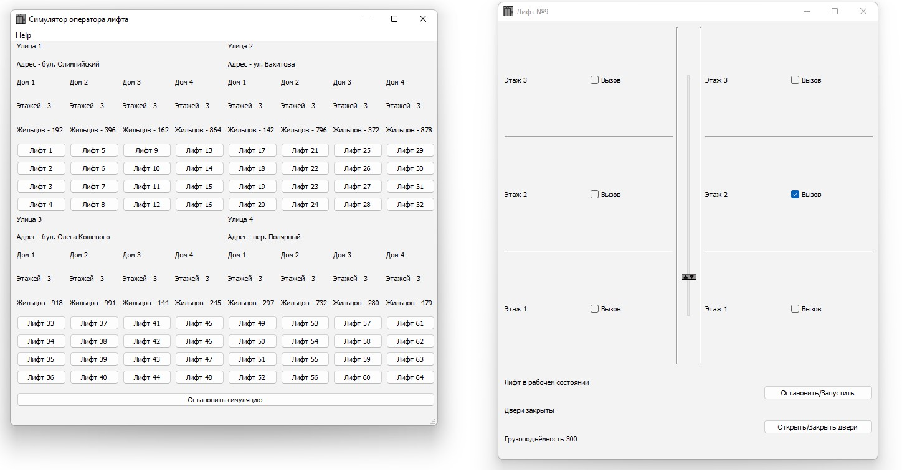
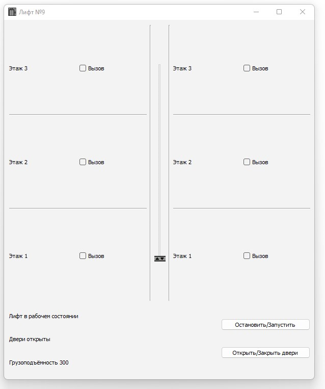

# Лифт

"Симулятор оператора лифта" - это программа, в которой предоставляется возможность симуляции работы лифтов и их управления. Пользователь может взаимодействовать с виртуальным лифтом, эмулируя различные сценарии движения, их остановки и запуска.

Используются: **MVC pattern** (~event driven), **observer pattern, asyncio, FCFS(FIFO) queue**

## Архитектура

Симулятор оператора лифта опирается на архитектуру, объединяющую несколько ключевых принципов разработки. 

### MVC

В основе архитектуры симулятора лифта лежит паттерн проектирования MVC.

Внутри этой архитектурной концепции выделяется паттерн проектирования MVC, где Model, содержащая данные о состоянии лифта, View, предоставляющая визуальное представление процесса, и Controller, управляющая взаимодействием с пользователем.

Архитектура MVC дополняется еще одним блоком случайных событий asyncio (подробнее в следующем пункте).




### Асинхронность

Для обеспечения управления событиями реализован асинхронный подход. Этот механизм позволяет программе обрабатывать параллельные процессы, такие как движение лифта, пользовательские команды и изменение состояния лифта.

При поступлении вызова лифт обрабатывает очередь и уведомляет о результатах обработки функций с помощью наблюдателей.


В концепции MVC (Model-View-Controller) подход с observer-ами обычно называется "наблюдатель" или "паттерн наблюдатель" (Observer pattern). Этот паттерн является поведенческим паттерном проектирования, который определяет отношение "один ко многим" между объектами так, что при изменении состояния одного объекта все зависящие от него объекты автоматически уведомляются и обновляются.

В контексте MVC, Model представляет данные и логику, View отвечает за отображение данных пользователю, а Controller обрабатывает пользовательский ввод и взаимодействует с Model и View. В данной программе паттерн наблюдатель используется для связи между Model и View.

Когда состояние Model изменяется, все зарегистрированные View автоматически уведомляются об этом изменении, и они могут обновить себя в соответствии с новыми данными. Это позволяет достичь разделения ответственности и уменьшить связанность между компонентами приложения.


## Логика

### Множественные вызовы лифта.

Выбор маршрута при наличии нескольких вызовов - это одна из ключевых задач системы управления лифтом. Различные алгоритмы могут использоваться для оптимизации маршрута лифта:

Можно использовать различные алгоритмы, например:

1. **FCFS** (First-Come-First-Served):

- Принцип: Лифт обслуживает вызовы в порядке их поступления.
- Преимущество: Простота и предсказуемость.
- Недостаток: Может привести к долгим временам ожидания для пассажиров на удаленных этажах.

2. Shortest-Path:

- Принцип: Лифт выбирает тот вызов, который минимизирует расстояние до следующего этажа.
- Преимущество: Минимизация времени в пути и энергопотребления.
- Недостаток: Не всегда учитывает загруженность других этажей.

3. SCAN (Эlevators) / LOOK (Modified SCAN):

- Принцип: Лифт движется в одном направлении до конца шахты, а затем возвращается в другом направлении.
- Преимущество: Более равномерное обслуживание всех этажей.
- Недостаток: Возможны долгие времена ожидания для вызовов в определенных областях.

4. C-SCAN (Circular SCAN):

- Принцип: Похож на SCAN, но лифт переходит к другому концу шахты после достижения одного конца.
- Преимущество: Минимизация времен ожидания.
- Недостаток: Время ожидания все еще может быть долгим для вызовов в середине пути.

5. Thompson's Algorithm:

- Принцип: Учитывает как текущие, так и будущие вызовы, оптимизируя маршрут с учетом прогноза.
- Преимущество: Адаптивность к изменяющимся паттернам вызовов.
- Недостаток: Сложнее в реализации.

На практике алгоритмы управления лифтами в рядовых жилых домах могут существенно различаться, и часто выбор зависит от конкретной модели лифта и предпочтений лифтового оборудования. Однако в жилых домах часто применяются простые алгоритмы управления, такие как **FCFS** (First-Come-First-Served), который обслуживает вызовы в порядке их поступления.

Простота и надежность такого алгоритма делают его распространенным вариантом для небольших и средних зданий. Когда вызывается лифт, он отправляется на соответствующий этаж в порядке очереди. Это обеспечивает справедливое обслуживание, но при этом может привести к некоторым задержкам для пассажиров, особенно если есть вызовы на удаленных этажах или на этажах, которые лифт еще не посетил.

Поэтому в рамках данной работы было принято решение реализовать простейший алгоритм FCFS (в рамках последующей структуры данных - **FIFO**) с использованием структуры данных "очередь" (**queue**). Очередь поддерживает операции добавления элемента в конец очереди (enqueue) и извлечения элемента из начала очереди (dequeue), что соответствует принципу "первым пришёл - первым вышел".

В коде используется следующим образом:
```python
# разные фрагменты кода иллюстрирующие использование очереди и реализующие алгоритм FIFO
floors_queue = Queue()
...
floors_queue.put(floor + 1)  # Добавить вызов на необходимый этаж
...
floors_queue.get()  # Взять первый вызов
```

### Случайные события

В асинхронном цикле генерируются случайные события вызова лифта. Общий асинхронный цикл обрабатывает события ежесекундно, поэтому во избежание конфликтов не рекомендуется делать множество действий в одну секнуду. Это ограничение можно избежать увеличением скорости тика цикла (если позволяют ресурсы компьютера).

Каждая отдельная task (конкретный лифт) может создать случайный вызов в собственном доме с шансом 13% (оптимальное значение, найденное экспериментальным путем).  Если долго не появляется вызова, то возможно, просто стоит подождать.

## Развитие

Некоторые моменты были преобразованы или реализованы немного в другом стиле (к примеру встроенный queue не имеет возможности отображения списком). Программа может развиваться далее и служит лишь демонстрацией примененной архитектуры, алгоритмов и структур данных.

Что можно добавить:

* дома с разным количеством этажей (основа для реализации уже есть)
* прочий функционал оператора
* добавить больше наблюдателей для отображения информации текущего этажа и того, на который отправляется (немного ресурсозатратно, но реализуемо)
* логгирование

## Примеры

#### Лифт отправился на вызов



#### Лифт спустился и выпустил пассажиров

